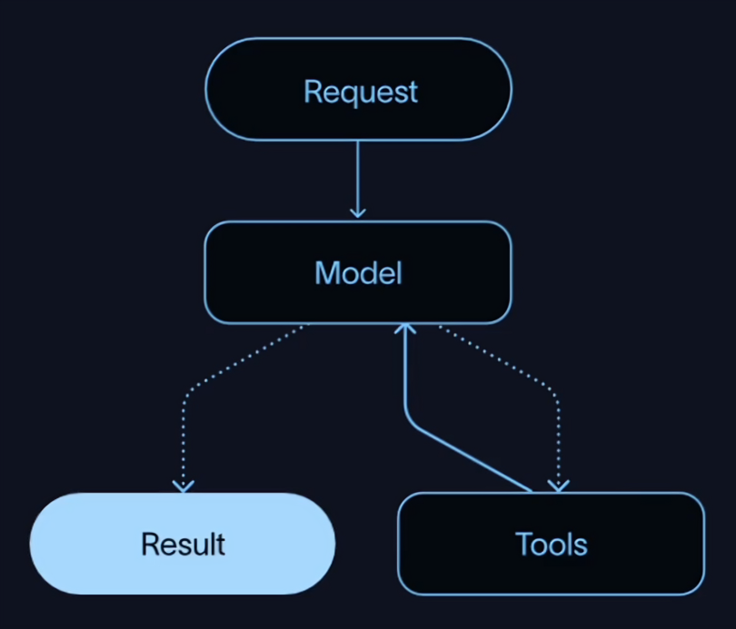
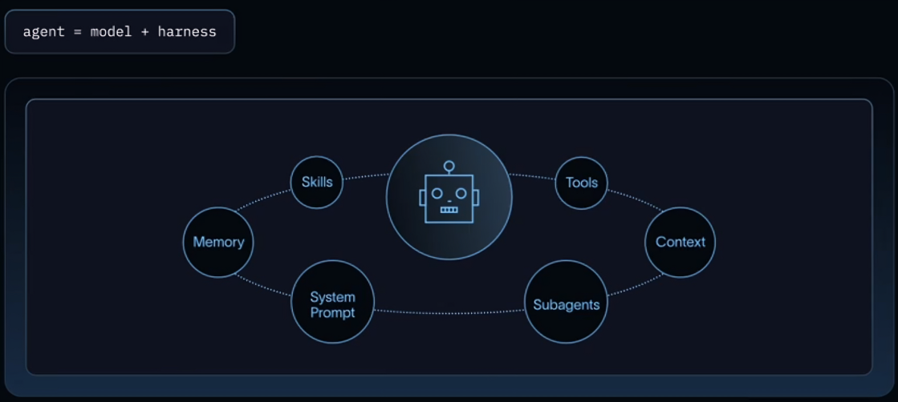
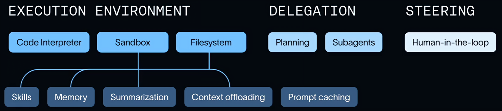
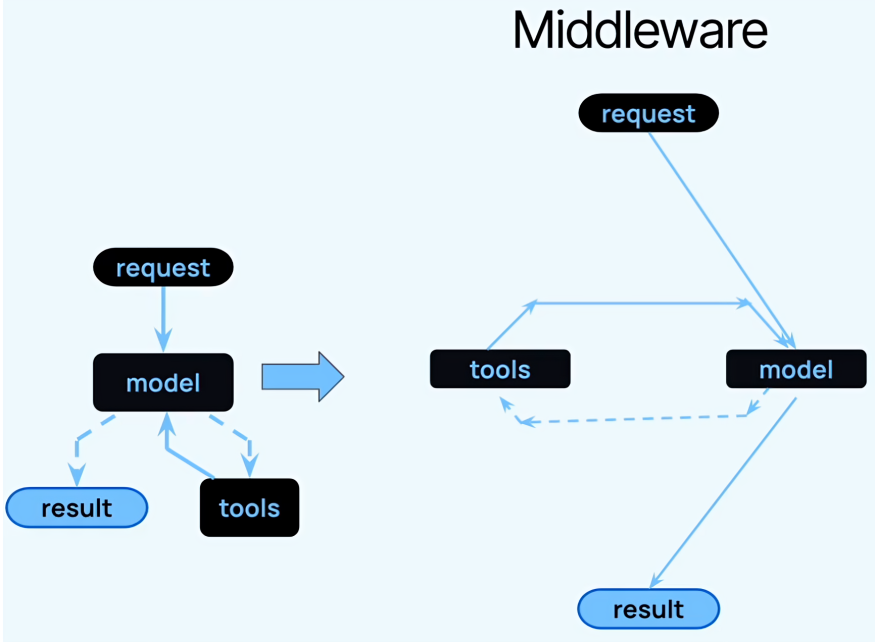

# introduction-to-deep-agents

## What is an agent?
- A model calling tools in a loop until it completes a task and returns a result.

## What is a harness?
- The harness is everything that connects the model to the real world, everything around the model that helps it complete tasks. This is made up of skills, memory, the base system prompt, tools, subagents, and any additional context.

## what is the job of a harness?
- To get the model the right context at the right time for the given task. A model is only as powerful as the context that it's given, and so the harness exists to bridge this gap.

## Why do we need a harness?
- Agents need:
    - Work in an environment where they can take actions
    - Connect to our data
    - Manage growing context over long runs to avoid context overflow.
    - Parallelize tasks: Need to be able to Parallelize tasks to complete complex tasks efficiently.
    - Connect with a human in the loop: for sensitive workflows.
    - Improve over time: so they remain relevant and useful

## What is Deep Agents?
- A customizable agent harness purpose built for complex, real-world tasks. There are four main capabilities of the Deep Agents harness.
    1. Execution Environment: Backbon of a Harness
        - Code Interpreter
        - Sandbox
        - FileSystem
    2. Context Management:
        - Skills support
        - Memory
        - Summarization Capabilities
        - Context Offloading
        - Prompt Caching
    3. Delegation: As agents run for longer amounts of time and take on complex workflows, they need to plan and organize tasks and then use subagents to delegate work.
        - Planning
        - Subagents
    4. Steering:
        - Human in the loop

    

- Middleware
    
    

